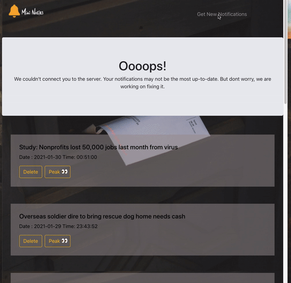

# 🔔 Mini Noties

Check out the deployed demo [Mini-Noties](mini-noties.herokuapp.com)

## 📝 Prompt

(Credit: Mr. Dinesh Nadar at [Resilia](https://www.resilia.com/))

1. Build a simple app that displays a list of notifications on a web page.
2. The app's user is the recipeint of the notifications.
3. Front end should request notifications from an API.
4. Notifications should be housed in a persistent store.
5. Persistent store should survive the API server restarting

---

## 🧠 Ideas:

1. GNews API used for fetching news notifications
2. Webpage displays the payload with titles, and option to open modal to "peak" inside the notification.
3. User can delete the notification from the page.
4. User can open modal, and read the article by clicking the button & opening the article in another tab.
5. User can re-fresh for new notifications, and get notified when the payload is already up-to-date.
6. When server is un-reachable, page displays message telling user that the notification may not be the most up-to-date, and displays lastest fetched notifications saved in localStorage.

---

## 👀 Examples:

Case: Server working as normal:


==

Case: Unable to connect to server:


---

## 🧰 Tools used:

[create-react-app](https://reactjs.org/docs/create-a-new-react-app.html)

[react-redux](https://react-redux.js.org/)

[axios](https://www.npmjs.com/package/axios)

[react-bootstrap](https://react-bootstrap.github.io/)

[GNews-API](https://gnews.io/)

[heroku](https://heroku.com)

---

## 👾 How to use this repository:

```shell
git clone https://github.com/TaihuaRubin/mini-noties.git
npm install
npm start
```
